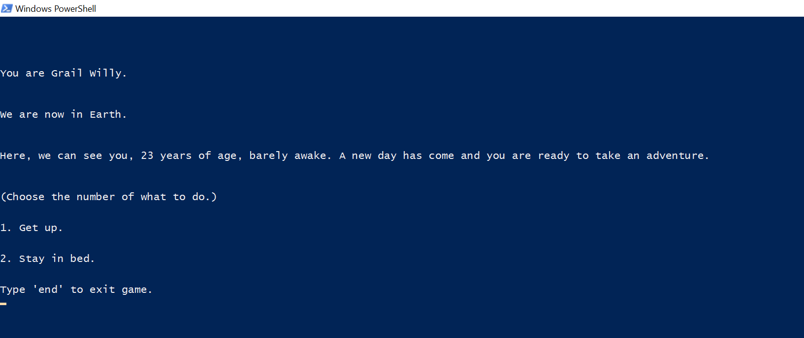

# Choose-Your-Own-Adventure
interactive storytelling

### Features
- Become the protagonist of the story.

### Usage 
  1. Getting Started <br/>
    ```type "ruby CYOA.rb" in the powershell ``` <br/>
    ``` press "enter"  ```
      <br/>
  
  2. Log in <br/>
    ``` enter your name , age and where you live then type```<br/>
     ```type "Y" to begin adventure``` <br/>
     ```type "N" to change your name``` <br/>
     ```type "A" to change your age``` <br/>
     ```type "L" to change your address``` <br/>
     ```type "end" to exit game``` <br/>
      <br/>
     
  3. Playing <br/>
     ```type the number or letter of your choose``` <br/>
      <br/>
     
  3. End Game <br/>
    ```  type "end" to end the game. ```<br/>
     <br/>

### Contributing
Your welcome to contribute. <br/>
Fork and Pull Request!
